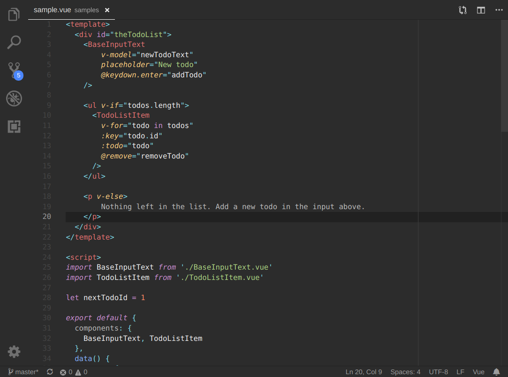

## Materia Theme for VS Code

Inspired by and derived from [Material Theme](https://github.com/equinusocio/material-theme), with a few additions and personal tweaks.   
This is a variation on [Material Basic](https://github.com/m-thorsen/vscode-material-mt),
tailored to match [Materia GTK Theme](https://github.com/nana-4/materia-theme).  
Token colors have been updated to closer match material.io

#### Tweaks/additions
* Better support for PHP and Vue
* Highlight current line number
* Highlight current indent guide
* JS/PHP tokens more in line with the Sublime theme
* Less noisy docblocks
* And more...

Workbench is of course fully themed.

